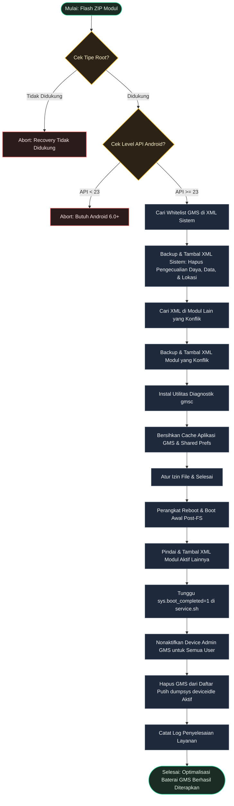

[English](README.md) | [Bahasa Indonesia](README.id.md)

# GmsForge

**Optimalkan Google Play services untuk mencegah pengurasan baterai terus menerus.**


## Deskripsi Umum

GmsForge adalah modul root yang mengoptimalkan Google Play services (`com.google.android.gms`) untuk mencegah pengurasan baterai di latar belakang. Modul ini mencabut hak pengecualian latar belakang pada Google Play services, sehingga menghemat daya baterai tanpa mengganggu notifikasi dan sinkronisasi penting.

---

## Mengapa Memilih GmsForge?

- **Optimasi Baterai**: Menghapus Google Play services dari pengecualian latar belakang untuk menghentikan pengurasan baterai saat perangkat siaga.
- **Keamanan Boot-Level**: Menonaktifkan aktivitas administrator dan siklus sinkronisasi yang tidak diperlukan di latar belakang pada setiap booting.
- **Utilitas Diagnostik**: Menyertakan utilitas baris perintah sederhana untuk memantau status modul dan tingkat optimasi.

---

## Persyaratan Sistem

| Persyaratan | Detail |
|-------------|--------|
| Android | 6.0+ (API 23+) |
| Alat Diagnostik | Utilitas command-line bawaan `gmsc` (membutuhkan akses root) |
| Root | Magisk v20.4+, KernelSU, atau APatch |

---

## Instalasi

1. Pasang berkas ZIP modul melalui tab **Modules** di manajer root Anda (Magisk, KernelSU, atau APatch).
2. **Reboot** (Mulai ulang) perangkat Anda untuk menerapkan pengoptimalan baterai secara global.

---

## Penggunaan

Anda dapat mengaudit status pengoptimalan kapan saja menggunakan alat diagnostik bawaan (memerlukan root shell):
```sh
su
gmsc
```
Untuk bantuan dan perintah tambahan:
```sh
gmsc --help
```

---

## Pemecahan Masalah

### Notifikasi Pesan Terlambat
Jika notifikasi pesan langsung dari aplikasi percakapan (seperti WhatsApp, Telegram) terlambat masuk, kecualikan aplikasi tersebut dari optimasi baterai di **Pengaturan → Baterai → Optimasi Baterai** pada perangkat Anda.

### Dampak Fitur Find My Device
Modul ini menonaktifkan receiver administrator perangkat GMS, yang dapat memengaruhi fungsi pelacakan jarak jauh latar belakang milik Google Find My Device. Untuk mengaktifkannya kembali secara manual:
```sh
su
pm enable com.google.android.gms/com.google.android.gms.mdm.receivers.MdmDeviceAdminReceiver
```
*(Catatan: Perubahan manual ini akan disetel ulang secara otomatis pada boot berikutnya oleh layanan boot modul untuk melindungi konsumsi daya).*

---

## Cara Kerja



---

## Pengembang & Lisensi

- **Pengembang**: [dyokism](https://github.com/dyokism)
- **Lisensi**: MIT
