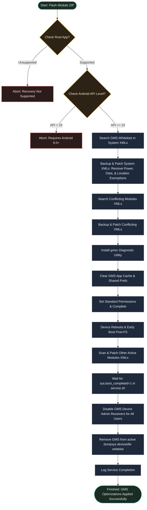

[English](README.md) | [Bahasa Indonesia](README.id.md)

# GmsForge

**Optimize Google Play services to prevent idle battery drain.**


## Overview

GmsForge is a root module that optimizes Google Play services (`com.google.android.gms`) to prevent background battery drain. It removes background exemptions for Google Play services, saving battery life while keeping notifications and essential sync features working.

---

## Why Use GmsForge?

- **Idle Battery Optimization**: Removes Google Play services from background exemptions to stop idle battery drain.
- **Boot-Level Security**: Disables unnecessary background administrator activities and sync loops on every startup.
- **Built-In Diagnostics**: Includes a simple command-line utility to monitor module status and optimization states.

---

## Requirements

| Requirement | Details |
|-------------|---------|
| Android | 6.0+ (API 23+) |
| Diagnostic | Built-in `gmsc` command-line utility (requires root) |
| Root | Magisk v20.4+, KernelSU, or APatch |

---

## Installation

1. Install the module ZIP via your root manager's **Modules** tab (Magisk, KernelSU, or APatch).
2. **Reboot** your device to apply the battery optimizations globally.

---

## Usage

You can audit the optimization status anytime using the built-in diagnostic tool (requires root shell):
```sh
su
gmsc
```
For help and additional commands:
```sh
gmsc --help
```

---

## Troubleshooting

### Delayed Push Notifications
If real-time chat notifications from messaging apps (e.g., WhatsApp, Telegram) are delayed, exclude those specific apps from battery optimization in your device's **Settings → Battery → Battery Optimization**.

### Find My Device Impact
This module disables GMS device administrator receivers, which can affect the background remote locate functionality of Google's Find My Device. To manually re-enable it:
```sh
su
pm enable com.google.android.gms/com.google.android.gms.mdm.receivers.MdmDeviceAdminReceiver
```
*(Note: This manual change will be reset upon the next reboot by the module's late boot service to protect battery life).*

---

## How It Works



---

## Developer & License

- **Developer**: [dyokism](https://github.com/dyokism)
- **License**: MIT
